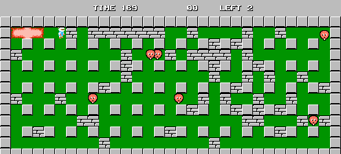
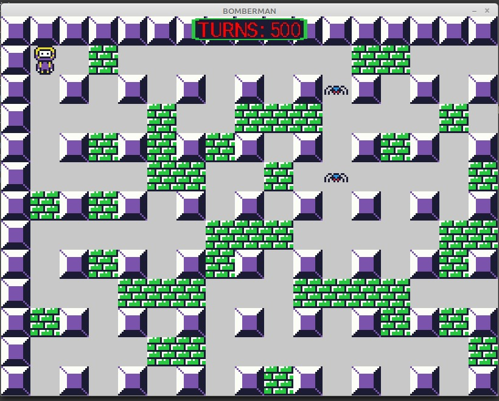

# Larga vida a Bomberman


Sin lugar a dudas, desde su lanzamiento en 1983, Bomberman se convirtió en un
clásico de los video juegos. Es por ello que en este segundo proyecto le haremos
un homenaje implementando nuestra propia versión. En específico, nos enfocaremos
en la versión clásica. Para su implementación, pueden usar todo lo visto en el
curso. Acá un video para aquellos que no la conozcan: [Enlace](https://youtu.be/DoFUpG1Ijk0)


Según el nivel de complejidad de su implementación, se asignarán las
calificaciones. Es por ello que distinguiremos 3 versiones del juego:

## Versión 1: Interfaz por consola y navegación simple

 - El tamaño del laberinto puede ser variable, definiéndose su tamaño por medio de ingreso por teclado. Para reservar el espacio del laberinto, pueden utilizar el stack o el heap (memoria dinámica).
 - El diseño del laberinto debe seguir el diseño del laberinto clásico (ver Figura 1). En este diseño, existirán bloques sólidos, que no pueden ser destruidos, y bloques blandos, que pueden ser destruidos por medio de bombas. A diferencia del juego original, en nuestra versión la posición de los bloques blandos puede ser al azar.
 - La visualización del laberinto, bloques y posición del jugador, se debe realizar por medio de la consola, utilizando las funciones de impresión que hemos visto. Cada grupo es libre de utilizar la simbología que estime conveniente para distinguir cada uno de los elementos del laberinto.
 - El juego se llevará a cabo por turno. En cada turno el jugador podrá realizar una de las siguientes acciones: avanzar una posición hacia la derecha, avanzar una posición hacia la izquierda, avanzar una posición hacia la arriba o avanzar una posición hacia la abajo o poner una bomba en la posición actual.
 - Una vez que una bomba es instalada en una casilla, esta explotará luego de 5 turnos. Cuando una bomba explota, su radio de alcance será de 1 casilla. Es decir, serán eliminados los bloques blandos comprendidos una casilla arriba, abajo, izquierda o derecha.
 - Mientras una bomba esté instalada, no se pondrán instalar más bombas, a menos que se obtenga un power-up (ver versión 2 del juego).
 - Uno de los bloques blandos esconderá una puerta, la cual debe ser encontrada para finalizar exitosamente el juego.
 - El juego finaliza en 3 casos: La cantidad de turnos restantes llega a 0, se encuentra la puerta de salida, el jugador es alcanzado por la explosión de una bomba.
 - El juego tendrá un menú por medio del cual el jugador podrá interactuar con el juego.
 - Adicionalmente, se dispondrá de un recuadro de avance/estado, en el cual se mostrarán los turnos restantes para terminar el juego.


|  |
|:--:|
| <b>Figura 1.</b> Laberinto clásico de Bomberman.|


## Versión 2: Versión 1 + Power-Ups

Esta versión considera la versión 1 más la implementación de, al menos dos, de los siguientes power-ups:

 - **Flame:** Por cada power-up flame adquirido el radio de alcance de las bombas incrementa en una casilla.
 - **Bomb:** Por cada power-up bomb adquirido, se puede instalar una bomba extra de manera simultánea.
 - **Speed:** Por cada power-up speed adquirido, el jugador puede desplazarse una casilla más por turno.

Los power-ups se encuentran escondidos en los bloques blandos. Para adquirir un
power-up, basta con destruir el bloque que lo contiene. La cantidad de power-ups
de cada tipo y su cantidad quedan a criterio de cada grupo.


## Versión 3: Versión 2 + Interfaz gráfica

Para esta versión, se pide implementar la versión 2 con una interfaz gráfica más atractiva utilizando la [biblioteca SDL](https://www.libsdl.org/).

### Consideraciones finales

 - Este proyecto se desarrollará en grupos de 2 a 3 personas.
 - La implementación deberá ser modular. Para ello, se debe hacer uso de funciones, las cuales permitan separar la implementación en bloques lógicos claramente definidos.
 - Este documento sólo define las reglas básicas del juego. Queda a criterio de los integrantes del grupo definir cualquier otra característica que no quede definida.
 - Cualquier funcionalidad adicional obtendrá puntaje extra.


## Solución propuesta
- Autores   :  Esteban Suazo (esuazo2019@udec.cl), Cristian Catrileo (ccatrileo2019@udec.cl) y Vicente Cser (vcser2018@udec.cl)          
- Carpetas : src, audio, assets
- Compilación: 
 ```
make
 ```
- Dependencias: SDL2, SDL2_image, SDL2_ttf, SDL2_mixer

- Controles:
    - Flechas de dirección para moverse
    - Tecla **z** para poner bombas
    - Tecla **x** para esperar un turno
    - Tecla **esc** para salir del juego

|  |
|:--:|
| Screenshot de la implementación.|
